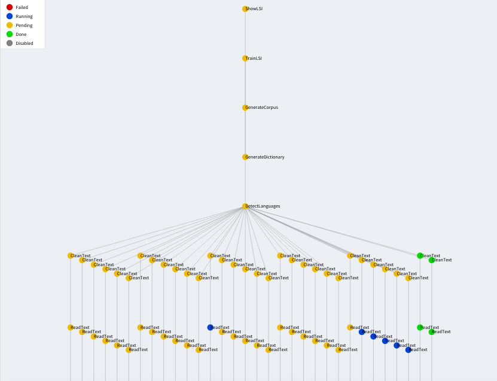
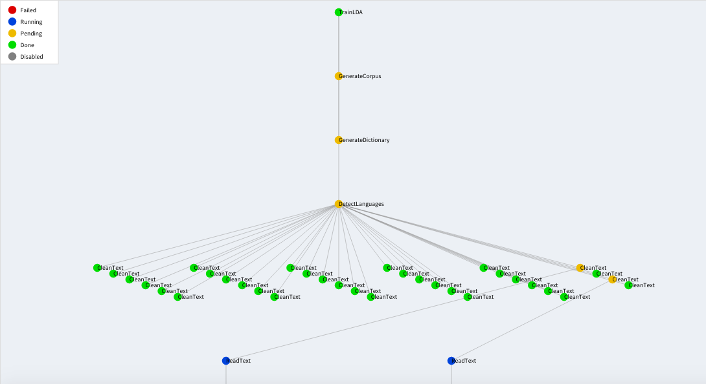

# 0. El problema por resolver

# 1. Orquestación

Es importante que un sistema de análisis de esta escala sea robusto y confiable. Para ello se optó por utilizar el orquestador [luigi](http://luigi.readthedocs.org/en/stable/), que fue desarrollado por Spotify en el lenguaje `Python`. Este esquema tiene varias ventajas sobre los scripts simples, algunas de las cuales se enumeran a continuación:

1. *Modularidad:* El código se segmenta en pasos bien definidos, lo que facilita su mantenimiento y expansión.
2. *Robustez:* Se requiere que todos los pasos serialicen sus resultados a disco, lo que hace que el sistema sea resistente a fallos y que no tenga que repetir todo el proceso después de un error.
3. *Idempotencia:* Si se programa correctamente, los procesos sólo corren una vez. Incluso si se corre el proceso una segunda vez, sólo corre lo que no haya sido corrido antes.
4. *Paralelismo:* Es bastante sencillo paralelizar los procesos que convenga para utilizar los núcleos de un servidor grande de manera eficiente.

Obtener estas ventajas es relativamente simple con `luigi`. Lo único que se requiere es que los pasos tengan entradas y salidas bien definidas; un proceso únicamente requiere sus dependencias para correr y debe arrojar los resultados que necesite la siguiente sección.

`luigi` corre nativamente en `Python`, por lo que se puede hacer cualquier cosa que se pueda hacer en `Python`. Esto incluye llamar códigos en `shell`, `R` y muchos otros lenguajes. La mayoría de los procesos se hicieron directamente en `Python` por simplicidad, pero algunos se dejaron en otros lenguajes por diversas razones de conveniencia.

A continuación se describe a grandes rasgos los pasos del *pipeline*. Cabe mencionar que esta descripción es para entender el proceso y *no* es una descripción técnica. Internamente hay algunos procesos que se efectúan en un orden ligeramente distinto al aquí presentado, pero resultaría más complicado de entender, de modo que presentamos una versión didáctica.

## a. Extracción de texto

En esta sección definimos a grandes rasgos los diversos componentes del *pipeline* de datos, desde los archivos en PDF crudos hasta las salidas necesarias para mostrar en el producto final.

### (i) Pegado de PDFs en archivos de 50 MB

--> Petri

### (ii) Extracción de texto a partir de PDFs y detección de idioma

**Input:** PDFs crudos, en el formato descrito abajo.

**Output:** Libros en formato texto tal cual fue extraido, archivos JSON con extractos de los libros.

**Paquetes relevantes:** `pdfminer`, `nltk`

El proceso empieza con una carpeta general en la que deben estar todos los PDFs. Adentro de ella debe haber una carpeta por libro que contenga los PDFs de las diversas hojas, por ejemplo: `pdf/libro_de_arte/hoja_i.pdf`

Se extraen los textos utilizando el paquete `pdfminer` de `Python` y se juntan los resultados de todas las hojas en un solo archivo por libro. Posteriormente se detecta el idioma de cada texto utilizando la metodología propuesta por la UNAM, es decir, se observa qué porcentaje de las *stopwords* de cada idioma tiene un texto y se le asigna el idioma del que tenga mayor porcentaje. Después de la detección, los libros en versión texto se meten en una carpeta según su idioma. Adicionalmente, se guardan dos archivos de metadatos, uno con los idiomas registrados y otro con una relación entre los libros y sus idiomas correspondientes.

Por practicidad se optó por extraer los párrafos representativos en este mismo proceso. Para ello se tomaron 3 secciones de aproximadamente 500 letras al 10%, 50% y 90% de avance del libro aproximadamente. El criterio tiene cierta flexibilidad e intenta encontrar párrafos completos (que empiecen en salto de línea y mayúscula), aunque esto en general es poco preciso por la imperfección del OCR efectuado al momento de digitalizar los libros.

**Nota 1:** Esta extracción se considera que tiene nivel de limpieza "nulo", por lo que los resultados de la extracción se meten a la carpeta `raw` dentro de la carpeta de textos.

**Nota 2:** Por razones internas del funcionamiento de `luigi`, es imposible checar de antemano a qué carpeta debe ir cada libro, ya que no se puede saber su idioma antes de procesarlo. Para darle la vuelta a esta limitación, se generó una carpeta con un archivo de metadatos por libro, `libro.meta`, que sirve para que `luigi` pueda checar el árbol de dependencias.

### (iii) Limpieza de textos

**Input:** Libros en formato texto crudo.

**Parámetros:** Idioma(s) a procesar, nivel(es) de limpieza a obtener.

**Output:** Libros en formato texto limpio, según la especificación.

**Paquetes relevantes:** `nltk`, `unicodedata`

Según el nivel de limpieza elegido, se genera una estructura similar a la de los textos crudos (`raw`). Los dos niveles son incrementalmente más "limpios":

* Limpieza básica (`clean`):
    - Se quitan los acentos.
    - Se quitan los saltos de página.
    - Se pasa todo a minúsculas.
    - Se quitan los caracteres especiales que queden después de quitar los acentos.
    - Se quitan palabras cortas (de 3 o menos caracteres).
    - Se quitan palabras con algún caracter repetido 3 o más veces.
* Limpieza avanzada (`stopwords`):
    - Todo lo de la limpieza básica.
    - Se quitan las palabras poco informativas (*stopwords*).

Los dos pasos anteriores se generan de manera incremental, lo que significa que si se genera uno más avanzado, siempre se generan todos los anteriores. Cada nivel de limpieza genera una estructura similar a la generada en el paso de extracción (i.e. a la carpeta `raw`), pero con nombre y características según sea el caso.

**Nota:** Nuevamente se utilizó un esquema de dependencias artificiales como en la extracción.

## b. Minería de textos

Una vez habiendo extraido y preparado los textos se puede empezar el proceso de minería. De aquí en adelante los procesos generan varios resultados, uno para cada nivel de limpieza y para cada idioma que se pida al comenzar el programa.

### (i) Vectorización de textos

**Input:** Textos de un idioma dado, con un nivel de limpieza dado.

**Output:** Un diccionario con los conteos de palabras y el corpus vectorizado (matriz términos - documentos).

**Paquetes relevantes:** `gensim`

Los algoritmos de minería necesitan entradas numéricas que viven en espacios vectoriales. Por ello el primer paso del análisis es vectorizar los textos. En el paquete `gensim` este proceso se divide en dos etapas: (1) generar un `diccionario` con las palabras válidas dentro de la colección, y (2) generar una matriz términos - documentos, que contiene los conteos de cada término en cada documento. En `gensim` se le llama `corpus` a la matriz términos - documentos.

### (ii) Latent Dirichlet Analysis: Clusters por tópicos

**Input:** 

**Parámetros:**

**Output:** 

**Paquetes relevantes:** 
--> Lechuga

### (iii) Latent Semantic Indexing: Documentos similares

**Input:** Un diccionario y un corpus.

**Parámetros:** Número de dimensiones latentes a utilizar.

**Output:** Modelo vectorizado transformado con TF-IDF. Listas los libros similares a cada libro, en diversos formatos (JSON, CSV, HTML, XML, red).

**Paquetes relevantes:** `gensim`, `pandas`, `markdown`, `pandoc` (es de `bash`)

El Análisis de Semántica Latente o LSI se lleva a cabo en varias etapas:

1. Se pondera el corpus con el modelo TF-IDF para dar más relevancia a las palabras poco comunes.
2. Se genera el modelo de semántica latente.
3. Se calculan las similitudes entre los documentos y se guardan las más relevantes.

Al finalizar estos procesos se tiene varios archivos con información de los modelos de `gensim` y las salidas en diversos formatos. Cada uno de ellos tiene un fin distinto. Por ejemplo, el HTML y la red permiten visualizar fácilmente los resultados, con el fin de que un experto elija los parámetros óptimos del modelo, mientras que el JSON y el CSV permiten explotar la información en otros sistemas. El XML sirve para mostrar los resultados en la página web del producto.

## c. Paquete

Con el fin de obtener un producto redondeado en lugar de una colección de scripts, se optó por agruparlos en el paquete `itm` (ITAM Text Miner). De este modo la instalación es relativamente sencilla y checa la mayoría de las dependencias de `Python` automáticamente. Además esto nos permite guardar ejecutables en el `PATH` del servidor, lo que permite correr los códigos desde cualquier ruta.

### (i) Instalación

La instalación del paquete en Ubuntu es bastante simple. Se requiere instalar `Python`, `R` y algunas pocas librerías de `Python` usando `apt-get` y las demás se instalan solas al instalar la librería `itm`. Cabe mencionar que el proceso puede correr incluso si no están instaladas correctamente todas las dependencias, pero los procesos que las utilicen fallarán.

```
# Necesario para instalar R >= 3.1
echo "deb http://cran.rstudio.com/bin/linux/ubuntu trusty/" >> /etc/apt/sources.list && \
	sudo apt-key adv --keyserver keyserver.ubuntu.com --recv-keys E084DAB9

# Actualizar índices de apt-get
sudo apt-get update && \
	apt-get upgrade # Necesario para instalar R >= 3.1

# Instalar Python	2.7 y PyPi
sudo apt-get install -y \
	python2.7-dev \
	python-pip

# Instalar R (debe ser >= 3.1)
sudo apt-get install -y \
	r-base \
	r-base-dev && \
	R --version

# Librerías de álgebra lineal, Fortran y compilador de Markdown
sudo apt-get install -y \
	libblas-dev \
	liblapack-dev \
	gfortran \
	pandoc

# Librerías de Python que no se instalan bien solas
sudo apt-get install -y \
	python-numpy \
	python-scipy

# Instalar el paquete itm	y sus dependencias de Python
PACK = itm-0.1 # U otra versión
cd /ruta/a/paquete
echo ${PACK}.tar.gz && \
	cd /tmp && \
	tar xzf ${PACK}.tar.gz && \
	cd ${PACK} && \
	python setup.py install

# Instalar librerías de R y bajar stopwords de nltk (no se bajan al bajar el paquete)
R -e 'install.packages(c("dplyr", "optparse", "networkD3"), repos = "http://cran.us.r-project.org")'
python -c "import nltk; nltk.download('stopwords')"
```

### (ii) Breve guía de uso

Una vez instalado el paquete se puede acceder a los ejecutables desde la consola. Para facilitar su uso se escribieron dos *wrappers*, uno *simple* que sólo pide los parámetros indispensables (`itam-tm-default`) y otro *avanzado* (`itam-tm`) que requiere que se especifique todos los parámetros de entrada internos del proceso de `luigi`. El ejecutable *avanzado* corre un solo proceso a la vez y se debe conocer cómo funciona internamente el paquete, mientras que el *simple* corre todos los análisis para valores especificados de los parámetros.

A continuación se muestra cómo utilizar el *simple* para correr el análisis. Con el fin de probar la instalación y que todo corriera sin problemas, se instaló el paquete en un contenedor de Docker, desde donde se ejecutará todo.

Se empieza con una carpeta `test` en donde están los datos crudos:

```
root@7351c9042a96:/home/itam# ls -lh test
total 0
drwxr-xr-x 1 1000 staff 340 Oct 27 01:49 jpg
drwxr-xr-x 1 1000 staff 340 Nov  3 22:32 pdf
root@7351c9042a96:/home/itam# ls -lh test/pdf/
total 0
drwxr-xr-x 1 1000 staff  748 Oct 27 01:49 1200_years_of_italian_sculpture
drwxr-xr-x 1 1000 staff  680 Oct 27 01:49 12_dibujos_de_jose_maria_velasco
drwxr-xr-x 1 1000 staff 2.8K Oct 27 01:49 20_dibujos_mexicanos_de_maroto
drwxr-xr-x 1 1000 staff 2.5K Oct 27 01:49 revue_des_peintres
drwxr-xr-x 1 1000 staff  952 Oct 27 01:49 tehuantepec
drwxr-xr-x 1 1000 staff 1.8K Oct 27 01:49 vitral
drwxr-xr-x 1 1000 staff  884 Oct 27 01:49 zuniga
drwxr-xr-x 1 1000 staff  918 Oct 27 01:50 zurbaran
root@7351c9042a96:/home/itam# ls -lh test/pdf/zuniga/
total 12M
-rw-r--r-- 1 1000 staff 278K Oct 27 01:49 zun-ctp_00000001.pdf
-rw-r--r-- 1 1000 staff 261K Oct 27 01:49 zun-int_00000001.pdf
-rw-r--r-- 1 1000 staff 168K Oct 27 01:49 zun-int_00000002.pdf
-rw-r--r-- 1 1000 staff 208K Oct 27 01:49 zun-int_00000003.pdf
-rw-r--r-- 1 1000 staff 164K Oct 27 01:49 zun-int_00000004.pdf
-rw-r--r-- 1 1000 staff 139K Oct 27 01:49 zun-int_00000005.pdf
```

El siguiente paso es inicializar el servidor de `luigi`, con el comando siguiente (o alternativamente, se puede agregar `--local-sceduler` al llamar `itam-tm-default`):

```
root@7351c9042a96:/home/itam# luigid --background &
```

Lo anterior deja el servidor corriendo en segundo plano de manera silenciosa. En la dirección IP `8082` `luigi` genera un dashboard desde el cual se puede ver el avance. Se puede acceder a él desde un navegador yendo a la dirección `localhost:8082`. Ya con eso andando sólo es necesario correr el siguiente comando (parámetros de ejemplo):

```
root@7351c9042a96:/home/itam# itam-tm-default \
  -d test \
  --languages spanish,english \
  --clean-level clean,stopwords
  --topic-range-lda 3,10,2 \
  --topic-range-lsi 40,81,20 \
  --workers 6
```

Los parámetros equivalen a lo siguiente:

* `-d [ruta/maestra]` es la ruta que contiene la carpeta `pdf`.
* `--languages idioma1[,idioma2[,...]]` son los idiomas a procesar. Hay que notar que siempre se limpian todos los textos que no hayan sido procesados antes. Esta bandera afecta desde la creación del diccionario y el corpus en adelante.
* `--clean-level (raw|clean|stopwords)[,(raw|clean|stopwords)[,...]]` agrega los niveles de limpieza a procesar y a modelar.
* `--topic-range-lda start,stop+1,step` hace un modelo LDA para cada nivel de limpieza y para cada número de tópicos, para `start, start + step, ..., stop`.
* `--topic-range-lsi start,stop+1,step` hace un modelo LSI para cada nivel de limpieza y para cada número de tópicos, para `start, start + step, ..., stop`.
* `--workers n` lleva a cabo el proceso de extracción y limpieza con `n` procesos en paralelo.

Una vez corriendo lo anterior, el dashboard se ve, por ejemplo, como sigue:


El dashboard provee muchas formas prácticas para filtrar las tareas, según si están corriendo, si terminaron, si tuvieron algún problema, etc. Se puede ver también la información más relevante, como qué proceso está corriendo y con qué parámetros y qué proceso se está encargando de hacerlo. `luigi` también proporciona una vista de red, en la que se puede ver gráficamente el árbol de dependencias:



En este caso se puede ver que hay 6 procesos corriendo en paralelo (azul) la limpieza, y que la creación de modelos se hace en serie (se eligió hacerlo así por razones de memoria). Los nodos verdes ya han sido completados con éxito y los amarillos aún no tienen todas sus dependencias para poder correr o están esperando a que un trabajador se libere para ejecutarlas.

Con la gráfica es fácil ilustrar algunas de las ventajas del orquestador. Por ejemplo, si se agregan dos libros a la colección, sólo corren los procesos que son estrictamente necesarios (aquí, los modelos, etc.), pero no la limpieza que ya haya sido ejecutada:




